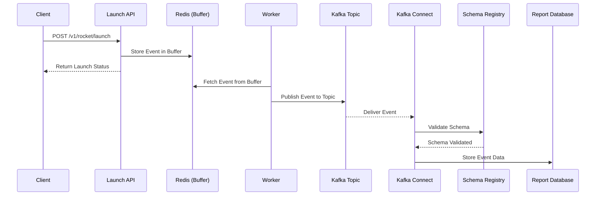

## Ítem 02: 
> Foi nos solicitado a criação de um relatório que mostre a utilização do serviço de lançamentos de foguetes separados por cada um dos nossos clientes em um intervalo de 30 dias. A nossa proposta para o desenvolvimento deste relatório é o de tentar evitar ao máximo algum impacto no fluxo de execução deste endpoint/api (de lançamento de foguetes), uma vez que este é o principal produto da empresa. Com essas premissas em mente, o time propôs a utilização apenas das solicitações/requests em comum com o atual serviço e armazenar os dados necessários para o relatório utilizando uma base de dados paralela à base de dados do serviço de lançamentos
> Como você atenderia essa demanda? Lembre-se, caso o novo workflow proposto para o armazenamento dos dados dos relatórios falhe, ele não deve impactar no serviço de lançamentos. Descreva em detalhes como você implementaria a solução

# Diagrama de Sequência - Kafka com Kafka Connect

## Explicação do Diagrama

1. **Cliente (Client)**:  O cliente faz uma requisição HTTP POST para o endpoint /v1/rocket/launch.

2. **API**: API processa a requisição e salva o evento no Redis, que funciona como um buffer intermediário.
3. **Redis (Buffer)**: Armazena temporariamente os eventos, garantindo que a API não seja impactada pela indisponibilidade do Kafka.
4. ** Worker**: Consome os eventos armazenados no Redis e publica no Kafka Topic.
5. **Kafka Topic**: Armazena os eventos publicados, garantindo sua persistência e possibilidade de reprocessamento.
6. **Kafka Connect**: Consome os eventos do tópico Kafka, utilizando o Schema Registry para validar os dados e persisti-los no banco de dados.
7. **Schema Registry**: Valida o esquema dos dados para garantir a compatibilidade e integridade das mensagens.
8. **Banco de Dados (ReportDB)**: Armazena os dados dos eventos consumidos, permitindo a geração de relatórios.
9. **Retorno ao Cliente**: Após salvar o evento no Redis, a API retorna imediatamente o status do lançamento ao cliente.

Essa solução aproveita a robustez e escalabilidade do Kafka, combinada com a velocidade e resiliência do Redis, garantindo alta performance e confiabilidade no processamento e armazenamento dos eventos.

---

# Por que usar Kafka em vez de RabbitMQ?

1. **Escalabilidade**: Kafka foi projetado para lidar com altos volumes de dados e escalabilidade horizontal. Ele é mais eficiente do que RabbitMQ em cenários com grandes fluxos de eventos.
2. **Persistência de Dados**: Kafka armazena mensagens em disco por um período configurável, permitindo reprocessamento de mensagens a qualquer momento. RabbitMQ não possui essa persistência tão robusta.
3. **Throughput Alto**: Kafka é otimizado para transferência de grandes volumes de mensagens com baixa latência, tornando-o ideal para cenários em que o desempenho é essencial.
4. **Consumer Groups**: O Kafka gerencia consumidores de forma eficiente, permitindo que vários consumidores processem mensagens de forma independente sem duplicar dados.
5. **Integração com Kafka Connect**: A extensibilidade do Kafka Connect permite integração fácil com bancos de dados e outros sistemas, otimizando o fluxo de dados sem necessidade de implementações customizadas.
6. **Ecossistema Robusto**: Ferramentas como o **Schema Registry** garantem consistência nos formatos de mensagem e evitam problemas de compatibilidade entre produtores e consumidores.

Embora RabbitMQ seja uma solução poderosa para cenários menores ou com menores requisitos de escalabilidade, o Kafka é mais adequado para sistemas de grande escala que exigem alta confiabilidade e desempenho.o Kafka, garantindo alta performance e confiabilidade no processamento e armazenamento dos eventos.