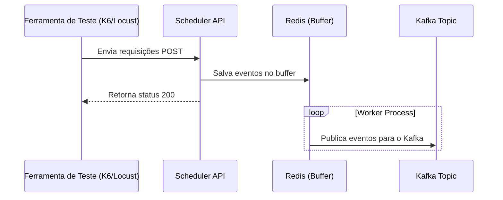

## Ítem 03: 
> Para evitar sobrecargas em serviços de terceiros, nossa squad decidiu implementar um agendador de eventos para ser utilizado durante a verificação do status de execução de uma operação de reenderização de vídeos em um dos nossos workflows orquestrados utilizando kafka. Como o kafka não permite o agendamento de eventos, a squad acabou por desenvolver um agendador próprio que armazena o evento temporariamente em um banco de dados do tipo chave/valor em memória, bem como um processo executará consultas (em looping) por eventos enfileirados no banco chave/valor que estão com o agendamento para vencer. Ao encontrar um, este agendamento é transformado em um novo evento em um tópico do kafka para dar continuidade ao workflow temporariamente paralizado pelo agendamento e finalmente removido do banco de agendamentos. Confome ilustrado no diagrama event_scheduler.png. Como o referido workflow deverá ser resiliente e essencial para o nosso produto, a squad gostaria de garantir que o serviço conseguirá suportar 1.000 requesições por segundo com o P99 de 30ms de latencia nas requisições
> Descreva detalhadamente quais testes você desenvolveria e executaria para garantir as premissas? Como você faria/executaria os testes propostos?


# Teste de Carga: Comparação entre K6 e Locust


Para realizar testes de carga no endpoint `/v1/render/scheduler`, duas bibliotecas principais podem ser usadas: **K6** e **Locust**. Ambas oferecem recursos avançados para simular cenários de alto volume de requisições e monitorar o desempenho do sistema.

## Comparação

| **Critério**        | **K6**                           | **Locust**                        |
|---------------------|----------------------------------|-----------------------------------|
| **Linguagem**       | JavaScript (para scripts)        | Python                            |
| **Performance**     | Alta, otimizado para testes CLI  | Alta, com interface interativa    |
| **Flexibilidade**   | Menos flexível para lógica avançada | Flexível, permite código Python avançado |
| **Visualização**    | CLI e ferramentas externas       | Interface web interativa          |

## Exemplo com K6

Crie um arquivo chamado `load_test.js`:

```javascript
import http from 'k6/http';
import { check, sleep } from 'k6';

export let options = {
    stages: [
        { duration: '1m', target: 1000 },
        { duration: '5m', target: 1000 },
        { duration: '1m', target: 0 },
    ],
    thresholds: {
        http_req_duration: ['p(99)<30'],
    },
};

export default function () {
    const url = 'http://localhost:8000/v1/render/scheduler';
    const payload = JSON.stringify({
        scheduler_datetime: new Date().toISOString(),
        event_content: { key: 'value' },
    });

    const params = {
        headers: {
            'Content-Type': 'application/json',
        },
    };

    let res = http.post(url, payload, params);

    check(res, {
        'status is 200': (r) => r.status === 200,
        'latency below 30ms': (r) => r.timings.duration < 30,
    });

    sleep(1);
}
```

Execute o teste:
```bash
k6 run load_test.js
```

---

## Exemplo com [Locust](https://locust.io/)

Crie um arquivo chamado `load_test.py`:

```python
from locust import HttpUser, task, between

class SchedulerLoadTest(HttpUser):
    wait_time = between(1, 2)

    @task
    def schedule_event(self):
        url = "/v1/render/scheduler"
        payload = {
            "scheduler_datetime": "2025-01-01T00:00:00Z",
            "event_content": {"key": "value"}
        }
        headers = {"Content-Type": "application/json"}

        with self.client.post(url, json=payload, headers=headers, catch_response=True) as response:
            if response.status_code == 200 and response.elapsed.total_seconds() < 0.03:
                response.success()
            else:
                response.failure(f"Failed with status {response.status_code} or latency {response.elapsed.total_seconds()}s")
```

Execute o teste:
```bash
locust -f load_test.py --host=http://localhost:8000
```

Acesse o painel Locust em `http://localhost:8089` e configure:
- **Number of total users**: 1000
- **Spawn rate**: 1000 users/second

Inicie o teste clicando em **Start Swarming**.

---

## Diagrama do Fluxo do Teste



---

## Conclusão

- **K6**: Ideal para cenários em que a simplicidade e a integração com pipelines CI/CD são prioritárias.
- **Locust**: Excelente para testes avançados e flexíveis, especialmente com lógica personalizada em Python.

Ambas as ferramentas são eficazes para validar se o sistema atende aos requisitos de desempenho e resiliência, mantendo a latência dentro dos limites estabelecidos.

